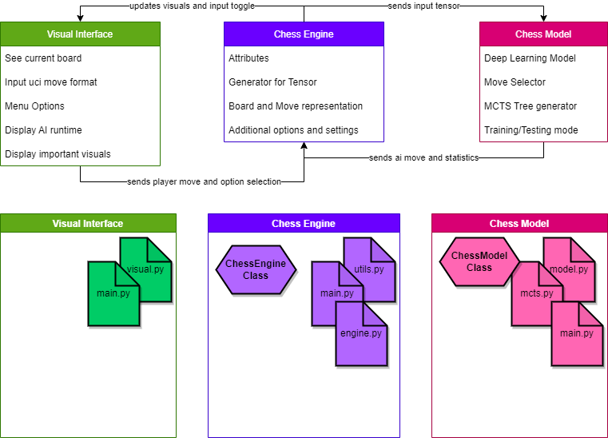

# XAI_Chess_2022_BA_CogSci
Repository for my Cognitive Science Bachelor Thesis from 2022.

## Abstract
Will be added soon.

## Motivation
Playing chess and strategy games generally is interesting not only for entertainment but also for training the mind.  
I believe in the value games can have for developing a strategic mindset and for understanding other agents, whether human or not.  
Hopefully the development of further Explainable AI techniques for game settings can help facilitate the insight into underlying strategies.  
Ultimately, the goal I see for AI in games is to learn how to implement better AI and use the AI's learned policies for furthering human understanding with the AI taking the role of a tutor. 

## About
This repository will, when the project is finalized, contain:
 * A trained Deep-Learning model based on AlphaZero for chess.
 * Algorithms applied in model implementation and analysis of the model.
 * Algorithms from the field of Explainable AI to be applied to the model.
 * A minimalistic visual interface for interacting with the model to play chess.
 * Data relevant for analysis of the model with figures and examples.

## Setup
Will be added soon.

## Structure
Will be added soon.

## Contact
Marlon Dammann <<mdammann@uni-osnabrueck.de>>

## References
Currently none